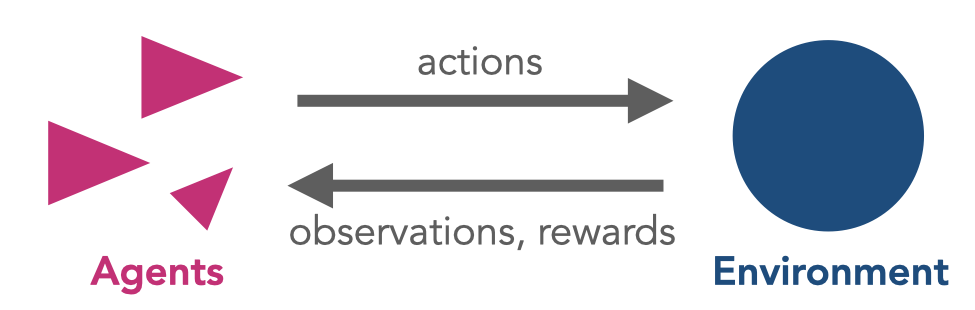
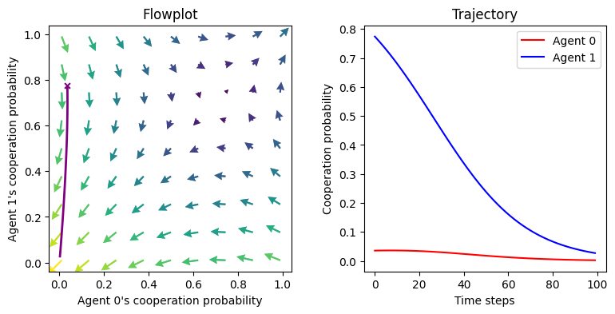

# CRLD


<!-- WARNING: THIS FILE WAS AUTOGENERATED! DO NOT EDIT! -->

**Collective Reinforcement Learning Dynamics** in Python

is a tool to model the collective dynamics emerging from multi-agent
reinforcement learning.

------------------------------------------------------------------------

Multi-agent reinforcement learning (MARL) provides a comprehensive
framework for studying the interplay among learning, representation, and
decision-making between multiple actors. As a result, it offers an
integrating platform to in-silico test hypotheses and build theory on
how different cognitive mechanisms affect collective adaptive behavior
in complex environments.



In combination with advances in machine learning, particularly deep
learning, modern MARL has produced spectacular successes in
high-dimensional environments. However, standard RL simulations have
significant disadvantages for modeling the collective behavior emerging
from MARL: they are *noisy*, sometimes *hard to explain*,
*sample-inefficient*, and *computationally intense*.

**CRLD** offers a solution in two ways of idealization. First, CRLD aims
to understand the principles behind collective behavior in idealized,
low-dimensional environments. Second, CRLD concentrates on the essence
of the stochastic and computationally intense reinforcement learning
algorithms by deriving their strategy-average, deterministic learning
equations.

In a nutshell, reinforcement learning agents strive to *improve* the
rewards they receive while inter*act*ing with the environment. In each
time step, they asses a sample of their current *reward-prediction
error* $\delta$.

The key idea of CRLD is to replace the individual sample realizations
with its strategy average plus a small error term,

$$
\delta \leftarrow \bar\delta + \epsilon.
$$

One can interpret these learning dynamics from a cognitive and an
engineering perspective. In the limit of a vanishing error term,
$\epsilon \rightarrow 0$, agents have a perfect model of the current
environment (cognitive interpretation) or an infinite replay buffer
(engineering interpretation)

How to put these ideas into practice?

## Install

First, let’s install the package from github:

``` sh
pip install "git+https://github.com/wbarfuss/pyCRLD.git"
```

## How to use

Second, we create a minimal example of a phase space portrait of the
learning dynamics in a classic social dilemma environment:

``` python
from pyCRLD.Agents.StrategyActorCritic import stratAC
from pyCRLD.Environments.SocialDilemma import SocialDilemma
from pyCRLD.Utils import FlowPlot as fp

import numpy as np
import matplotlib.pyplot as plt

# Init enviornment and MultiAgentEnvironment-interface
env = SocialDilemma(R=1.0, T=0.8, S=-0.5, P=0.0)
mae = stratAC(env=env, learning_rates=0.1, discount_factors=0.9)

# Compute learning trajectory 
x = mae.random_softmax_strategy()  # from a random inital strategy
xtraj, fixedpointreached = mae.trajectory(x)

# PLOT
fig, axs = plt.subplots(1,2, figsize=(9,4))
plt.subplots_adjust(wspace=0.3)

# Plot in phase space
x = ([0], [0], [0])
y = ([1], [0], [0])
ax = fp.plot_strategy_flow(mae, x, y, flowarrow_points = np.linspace(0.01 ,0.99, 9), axes=[axs[0]])
fp.plot_trajectories([xtraj], x, y, cols=['purple'], axes=ax);
ax[0].set_xlabel("Agent 0's cooperation probability")
ax[0].set_ylabel("Agent 1's cooperation probability");
ax[0].set_title("Flowplot")

# Plot in trajectory
axs[1].plot(xtraj[:, 0, 0, 0], label="Agent 0", c='red')
axs[1].plot(xtraj[:, 1, 0, 0], label="Agent 1", c='blue')
axs[1].set_xlabel('Time steps')
axs[1].set_ylabel('Cooperation probability')
axs[1].legend()
axs[1].set_title("Trajectory");
```



We see how the learning trajectories on the right result from the flow
on the left, which suggests that in this environment, mutual cooperation
and mutual defection are viable solutions, depending on the initial
cooperation levels of both agents.
